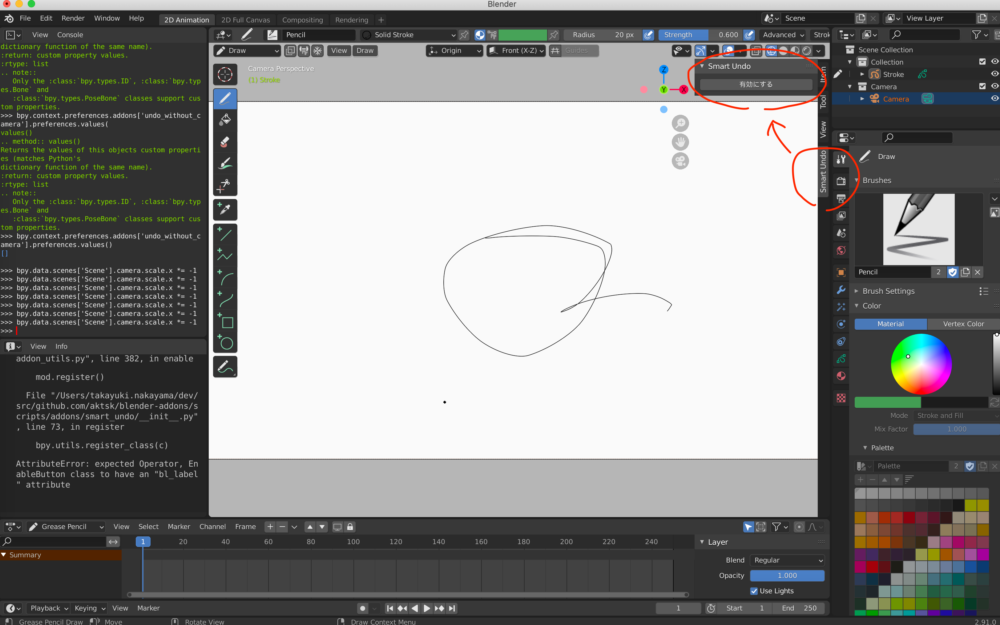

# Smart Undo

## Usage

インストールしたら有効になります。
以下のパラメータが、Undo時も維持されるようになります。

- scene.camera.scale.x
- scene.camera.rotation_euler.y

無効にしたい場合は、「無効にする」ボタンを押します。
再度有効にする場合は、「有効にする」ボタンを押します。



## Memo

キャンバスの反転や回転は、クリエイターが使うツールによって挙動が異なるもよう。
そのため、適用対象となるパラメータも変わってくると思われる。
一度このプラグインを使ってもらい、実際に動くか確認して貰う必要があり、場合によってはヒアリングもしたい。

有効及び無効にするボタンを画面右側のタブに配置したが、好みが分かれそう。
配置を変更することは難しくないので、使いやすいように適宜変更したい。


## For dev

## Setup

```
$ /Applications/Blender.app/Contents/MacOS/Blender
```

and 

In `Prefarence > Fole Paths > Data > Scripts`, set `/path-to-repo/scripts/`.

## Develop

```
$ /Applications/Blender.app/Contents/MacOS/Blender
```

and

1. edit codes.
2. In `Prefarence > Addons > Testing`, disable and enable `Object: undoWithoutCamera`.
