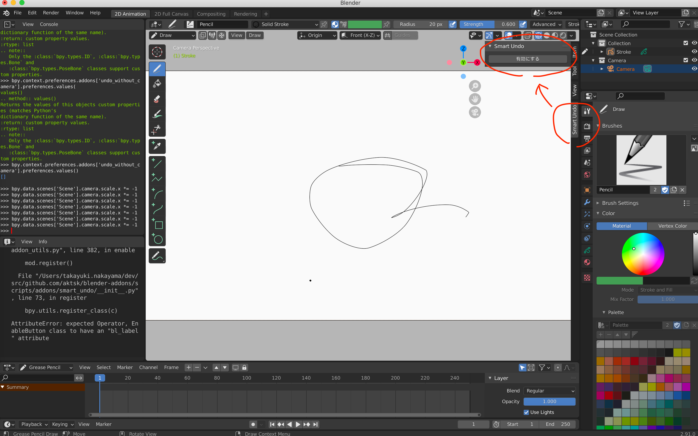

# Smart Undo

Undo (取り消し) を行っても、カメラの反転や回転は戻らないようにするアドオン

## インストール方法

1. メニューから `Prefarence > Addons` と開いて、左上の `Install` からこのフォルダ内の `__init__.py` を開きます
2. `Object: undoWithoutCamera` のチェックをつけると有効化されます

## 使い方

インストールしたら有効になります。

- 無効にしたい場合は、「無効にする」ボタンを押します。
- 再度有効にする場合は、「有効にする」ボタンを押します。

ショートカットで以下のように `smart_undo.switch_enabled` を割り当てることで、有効無効の切り替えができます。

## 開発メモ

キャンバスの反転や回転は、クリエイターが使うツールによって挙動が異なるもよう。
そのため、適用対象となるパラメータも変わってくると思われる。
一度このプラグインを使ってもらい、実際に動くか確認して貰う必要があり、場合によってはヒアリングもしたい。

有効及び無効にするボタンを画面右側のタブに配置したが、好みが分かれそう。
配置を変更することは難しくないので、使いやすいように適宜変更したい。
